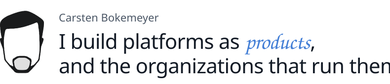

<!-- Generated from carstenb.github.io by profile/build.js. Do not edit here; changes are overwritten. -->

<picture>
  <source media="(prefers-color-scheme: dark)" srcset="assets/header-dark.svg">
  
</picture>

[Product strategy × Platform engineering × Organisational design](https://carstenb.github.io/#work)

**Principal Product Manager, Platform at Cint**

I work where product management, platform engineering and organisational design meet: APIs, developer experience, self-service and increasingly AI-native interfaces.

### What I work on

**01 · Platform as a product** 
Capabilities teams choose to use

**02 · APIs, MCP & ecosystems** 
The surface others build on

**03 · Product strategy** 
Where to invest, and why now

**04 · Team topologies & org design** 
Organizations shaped for flow

### What I build

**Mandoria**: Making care bureaucracy bearable.

Problem → care bureaucracy turns people into the integration layer 
Approach → AI-assisted solo product development 
Why → learn by building

I also build small tools and AI-assisted experiments to understand new technologies by using them.

 

Product work across **Cint, SmartRecruiters, Greator, Chefkoch and Studitemps** → [CV](https://carstenb.github.io/cv/)

[Website](https://carstenb.github.io/) · [CV](https://carstenb.github.io/cv/) · [LinkedIn](https://www.linkedin.com/in/carstenbokemeyer/) · [Email](mailto:mail@carsten-bokemeyer.de)

 

This profile is generated from [carstenb.github.io](https://carstenb.github.io/).
